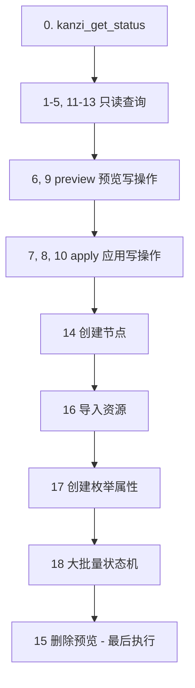

# Kanzi MCP 测试指令手册

本文档整理了 Kanzi MCP 的 18 项典型测试用例，可直接发给 Claude Code / Cursor Agent 执行。

---

## 0. 前置检查（每次测试前执行）

**自然语言：**

> 用 `kanzi_get_status` 检查 Kanzi MCP 连接状态，确认 Pipe、Studio、项目均已连接。

**工具：** `kanzi_get_status`

**参数：**

```json
{}
```

**期望：**

| 项目 | 期望 |
|------|------|
| Pipe 连接 | `connected: true`，端口 `9595` |
| Kanzi Studio | 已连接 |
| 已打开项目 | Untitled（或你的项目名） |
| Kanzi 版本 | v3.9.10.98 |

---

## 工具速查（18 个）

| 分类 | 工具 | 用途 |
|------|------|------|
| 🔍 查询 | `kanzi_query_nodes` | 按类型/名称/路径查询节点 |
| 🔍 查询 | `kanzi_get_node_tree` | 获取层级节点树 |
| 🔍 查询 | `kanzi_search_nodes` | 全文搜索节点 |
| 🔍 查询 | `kanzi_list_node_types` | 列出节点类型 |
| 🔍 查询 | `kanzi_get_binding_info` | 获取绑定详情 |
| 🔍 查询 | `kanzi_get_property_metadata` | 获取节点类型属性元数据 |
| ✏️ 编辑 | `kanzi_set_node_property` | 设置单个属性（preview/apply） |
| ✏️ 编辑 | `kanzi_batch_set_property` | 批量设置属性 |
| ✏️ 编辑 | `kanzi_create_node` | 创建节点 |
| ✏️ 编辑 | `kanzi_delete_node` | 删除节点（先 preview） |
| 🎛️ 高级 | `kanzi_create_state_manager` | 创建状态机（支持分批） |
| 🎛️ 高级 | `kanzi_upsert_custom_enum_property` | 创建/更新自定义枚举属性 |
| 🔬 审计 | `kanzi_audit_bindings` | 审计数据绑定 |
| 🔬 审计 | `kanzi_audit_project_structure` | 审计项目结构/命名 |
| 🔬 审计 | `kanzi_doctor_resource` | 诊断未使用/损坏资源 |
| 📦 资源 | `kanzi_import_image` | 导入图片到 Textures |
| 📦 资源 | `kanzi_import_fbx` | 导入 FBX 模型 |
| ℹ️ 状态 | `kanzi_get_status` | 连接状态 |

---

## 路径说明

项目中节点路径可用以下两种形式（任选其一，以实际项目为准）：

- 相对路径：`Screens/Screen/RootPage/Viewport 2D/Text Block 2D_1`
- 完整 URI：`kzb://untitled/Screens/Screen/RootPage/Viewport 2D/Text Block 2D_1`

节点类型支持别名：`Text Block 2D` / `TextBlock2D`、`Text Block 3D` / `TextBlock3D` 均可。

---

## 一、查询与搜索类（只读，优先执行）

### 1. 查询节点 — 按类型

**自然语言：**

> 查询项目中所有 `Text Block 2D` 类型节点，最多返回 50 个。

**工具：** `kanzi_query_nodes`

```json
{
  "type": "Text Block 2D",
  "limit": 50,
  "recursive": true
}
```

**验证：** `success: true`，`count ≤ 50`，每条含 `name`、`path`、`type`。

---

### 2. 查询节点信息 — 按路径（含属性与绑定）

**自然语言：**

> 查询 `Screens/Screen/RootPage/Viewport 2D/Text Block 2D_1` 的详细信息，包含属性和绑定。

**工具：** `kanzi_query_nodes`

```json
{
  "path": "Screens/Screen/RootPage/Viewport 2D/Text Block 2D_1",
  "includeProperties": true,
  "includeBindings": true,
  "recursive": false,
  "limit": 1
}
```

**验证：** 返回 1 个节点，`properties` 和 `bindings` 非空（若有绑定）。

---

### 3. 获取节点树

**自然语言：**

> 获取 `Screens/Screen` 下深度为 3 的节点树，不需要属性。

**工具：** `kanzi_get_node_tree`

```json
{
  "rootPath": "Screens/Screen",
  "depth": 3,
  "includeProperties": false
}
```

**验证：** 返回层级结构，`depth` 不超过 3，无 `properties` 字段。

---

### 4. 列出所有节点类型

**自然语言：**

> 列出 Kanzi 项目支持的所有节点类型。

**工具：** `kanzi_list_node_types`

```json
{}
```

**验证：** `nodeTypes` 数组含 `type`、`displayName`、`category`；数量 > 0。

---

### 5. 获取绑定信息（含元数据）

**自然语言：**

> 获取 `Screens/Screen/RootPage/Viewport 2D/Text Block 2D_1` 的绑定详情。

**工具：** `kanzi_get_binding_info`

```json
{
  "path": "Screens/Screen/RootPage/Viewport 2D/Text Block 2D_1",
  "includeMetadata": true
}
```

**验证：** 返回 `bindings` 列表，每项含 `property`、`code`、`mode`。

---

### 11. 获取属性元数据

**自然语言：**

> 查询 `Text Block 2D` 节点类型支持哪些属性。

**工具：** `kanzi_get_property_metadata`

```json
{
  "nodeType": "Text Block 2D"
}
```

**验证：** 返回属性列表，含 `FontStyleConcept.Size`（字号）、`TextConcept.Text` 等，标注类型与只读状态。

---

### 12. 审计项目结构

**自然语言：**

> 审计整个 Kanzi 项目的命名规范，检查嵌套深度和命名是否符合驼峰规则。

**工具：** `kanzi_audit_project_structure`

```json
{
  "checkDepth": true,
  "checkNaming": true,
  "namingPattern": "^[a-z][a-zA-Z0-9]*$"
}
```

> **注意：** Kanzi 节点名常含空格（如 `Text Block 2D`），严格小驼峰会大量误报。可按项目实际规范调整正则，例如 PascalCase：`^[A-Z][a-zA-Z0-9]*$`。

**验证：** 返回 `totalNodes`、`maxDepth`、`issues`、`score`、`recommendations`。

---

### 13. 文本搜索节点

**自然语言：**

> 搜索名称、路径或类型中包含 `Text Block 2D` 的节点，区分大小写。

**工具：** `kanzi_search_nodes`

```json
{
  "searchText": "Text Block 2D",
  "searchIn": ["Name", "Path", "Type"],
  "caseSensitive": true
}
```

**验证：** 命中节点的 `Name`/`Path`/`Type` 中精确包含 `Text Block 2D`。

---

## 二、属性编辑类（先 preview，再 apply）

### 6. 设置单个属性 — 预览

**自然语言：**

> 把 `Screens/TestPreview` 节点的 `Name` 改为 `Screen`，使用预览模式，不实际修改。

**工具：** `kanzi_set_node_property`

```json
{
  "path": "Screens/TestPreview",
  "property": "Name",
  "value": "Screen",
  "mode": "preview"
}
```

**验证：** 返回变更计划，`applied: false`；Studio 中节点名不变。

---

### 7. 设置单个属性 — 应用

**自然语言：**

> 把 `Screens/Screen` 节点的 `Name` 改为 `TestPreview`，直接应用。

**工具：** `kanzi_set_node_property`

```json
{
  "path": "Screens/Screen",
  "property": "Name",
  "value": "TestPreview",
  "mode": "apply"
}
```

**验证：** `applied: true`；Studio 中节点名已变为 `TestPreview`。

> **提示：** 用例 6、7 会互换 Screen/TestPreview 名称，建议成对测试，测完可改回。

---

### 8. 批量设置文本内容（2D + 3D）

**自然语言：**

> 把工程中所有 Text（2D 和 3D）节点的文本内容改为 `KanziMCPv0.1`，直接应用。

**工具：** `kanzi_batch_set_property`（需调用 **2 次**，分别处理 2D 和 3D）

**第 1 次 — Text Block 2D：**

```json
{
  "filter": { "type": "Text Block 2D", "recursive": true },
  "properties": { "TextConcept.Text": "KanziMCPv0.1" },
  "mode": "apply"
}
```

**第 2 次 — Text Block 3D：**

```json
{
  "filter": { "type": "Text Block 3D", "recursive": true },
  "properties": { "TextConcept.Text": "KanziMCPv0.1" },
  "mode": "apply"
}
```

**验证：** 返回 `affectedCount`；抽样检查 2D/3D 节点 `Text` 均为 `KanziMCPv0.1`。

---

### 9. 批量设置属性 — 预览

**自然语言：**

> 把所有 `Text Block 2D` 节点的文字改成 `all test`，预览模式。

**工具：** `kanzi_batch_set_property`

```json
{
  "filter": { "type": "Text Block 2D", "recursive": true },
  "properties": { "TextConcept.Text": "all test" },
  "mode": "preview"
}
```

**验证：** 返回受影响节点列表和变更预览，未实际写入。

---

### 10. 批量设置字体大小 — 应用

**自然语言：**

> 把所有 `Text Block 2D` 节点的字体大小设为 `150`，直接应用。字号属性为 `FontStyleConcept.Size`（不要用 `FontSize`）。

**工具：** `kanzi_batch_set_property`

```json
{
  "filter": { "type": "Text Block 2D", "recursive": true },
  "properties": { "FontStyleConcept.Size": 150 },
  "mode": "apply"
}
```

**验证：** `affectedCount > 0`；抽样节点 `FontStyleConcept.Size == 150`。

---

## 三、节点增删类

### 14. 创建 3D 文本节点

**自然语言：**

> 在 `Screens/Screen/RootPage/Viewport 2D/Scene` 下创建名为 `Test_3D_TEXT` 的 `Text Block 3D` 节点。

**工具：** `kanzi_create_node`

```json
{
  "parentPath": "Screens/Screen/RootPage/Viewport 2D/Scene",
  "nodeType": "Text Block 3D",
  "nodeName": "Test_3D_TEXT"
}
```

**验证：** `success: true`，返回新节点 `path`；用 `kanzi_query_nodes` 可查到该节点。

---

### 15. 删除节点 — 预览

**自然语言：**

> 预览删除 `Screens/Screen/RootPage/Viewport 2D/Test_Text_2D` 会有什么影响，不实际删除。

**工具：** `kanzi_delete_node`

```json
{
  "path": "Screens/Screen/RootPage/Viewport 2D/Test_Text_2D",
  "mode": "preview"
}
```

**验证：** 返回待删除节点及子节点列表；Studio 中节点仍存在。

---

## 四、资源与自定义属性类

### 16. 导入图片

**自然语言：**

> 把 `E:/wangtianyu/localization_Test/Image/L3_NCA_STANDBY.png` 导入到 `Textures` 文件夹。

**工具：** `kanzi_import_image`

```json
{
  "filePath": "E:/wangtianyu/localization_Test/Image/L3_NCA_STANDBY.png",
  "targetFolder": "Textures"
}
```

**验证：** `success: true`；Studio 资源库 Textures 中出现该纹理。

---

### 17. 创建自定义枚举属性

**自然语言：**

> 创建名为 `PropertyTest` 的自定义枚举属性，选项为 `Test1`~`Test20`，对应值 `1`~`20`。

**工具：** `kanzi_upsert_custom_enum_property`

**步骤 1 — 预览：**

```json
{
  "name": "PropertyTest",
  "displayName": "PropertyTest",
  "options": [
    {"name": "Test1", "value": 1}, {"name": "Test2", "value": 2},
    {"name": "Test3", "value": 3}, {"name": "Test4", "value": 4},
    {"name": "Test5", "value": 5}, {"name": "Test6", "value": 6},
    {"name": "Test7", "value": 7}, {"name": "Test8", "value": 8},
    {"name": "Test9", "value": 9}, {"name": "Test10", "value": 10},
    {"name": "Test11", "value": 11}, {"name": "Test12", "value": 12},
    {"name": "Test13", "value": 13}, {"name": "Test14", "value": 14},
    {"name": "Test15", "value": 15}, {"name": "Test16", "value": 16},
    {"name": "Test17", "value": 17}, {"name": "Test18", "value": 18},
    {"name": "Test19", "value": 19}, {"name": "Test20", "value": 20}
  ],
  "mode": "preview"
}
```

**步骤 2 — 确认后应用：** 同上，`mode` 改为 `"apply"`。

**验证：** 项目属性库出现 `PropertyTest`，含 20 个枚举项。

---

## 五、大批量状态机测试（用例 18）

### 前提条件

- Studio 已连接
- 枚举属性 `warnvalue` 已存在，含 `warn_1` ~ `warn_500`（值 1~500）
- 若已有 `WarningStateManager` / `WarningGroup`，先删除或换名
- 绑定节点路径：`Screens/Screen/RootPage/Viewport 2D`

**状态模板（preview/apply 共用，只传 1 条）：**

```json
{
  "stateName": "warn_{0}",
  "statePropertyValue": 1,
  "objects": [{
    "nodeName": "Text Block 2D",
    "nodePath": "Screens/Screen/RootPage/Viewport 2D/Text Block 2D",
    "properties": { "TextConcept.Text": "warning_{0}" }
  }]
}
```

`{0}` 展开为 1~500 → 得到 `warn_1`~`warn_500`，Text 为 `warning_1`~`warning_500`。

---

### 18a. Preview — 查看分批计划

**自然语言：**

> 用 `kanzi_create_state_manager` 预览创建 500 个 State 的分批方案，确认 `totalBatches=42`。

**工具：** `kanzi_create_state_manager`

```json
{
  "managerName": "WarningStateManager",
  "groupName": "WarningGroup",
  "groupProperty": "warnvalue",
  "bindNodePath": "Screens/Screen/RootPage/Viewport 2D",
  "mode": "preview",
  "autoGenerateCount": 500,
  "batchSize": 12,
  "states": [{
    "stateName": "warn_{0}",
    "statePropertyValue": 1,
    "objects": [{
      "nodeName": "Text Block 2D",
      "nodePath": "Screens/Screen/RootPage/Viewport 2D/Text Block 2D",
      "properties": { "TextConcept.Text": "warning_{0}" }
    }]
  }]
}
```

**验证：** `totalBatches == 42`（500 ÷ 12，末批 4 个）。

---

### 18b. Apply — 分批创建（batchIndex 0~41）

**自然语言：**

> 用 `mode=apply`、`confirmLargeBatch=true`，按 `batchIndex=0` 到 `41` 顺序执行，每批参数相同，只传 1 条模板。记录每批 `elapsedMs`；失败只重试该批。

**工具：** `kanzi_create_state_manager`（循环 42 次）

```json
{
  "managerName": "WarningStateManager",
  "groupName": "WarningGroup",
  "groupProperty": "warnvalue",
  "bindNodePath": "Screens/Screen/RootPage/Viewport 2D",
  "mode": "apply",
  "confirmLargeBatch": true,
  "autoGenerateCount": 500,
  "batchSize": 12,
  "batchIndex": 0,
  "states": [{
    "stateName": "warn_{0}",
    "statePropertyValue": 1,
    "objects": [{
      "nodeName": "Text Block 2D",
      "nodePath": "Screens/Screen/RootPage/Viewport 2D/Text Block 2D",
      "properties": { "TextConcept.Text": "warning_{0}" }
    }]
  }]
}
```

> `batchIndex` 从 `0` 递增到 `41`，其余参数不变。

**每批验证：**

| 批次 | 期望 `batchStatesCreated` |
|------|--------------------------|
| batchIndex 0~40 | 12 |
| batchIndex 41（末批） | 4 |
| 每批 | `success: true`，记录 `elapsedMs` |

---

### 18c. 验证

**自然语言：**

> 用 `kanzi_get_node_tree` 查看 `State Managers/WarningStateManager/WarningGroup`，确认有 500 个 State；抽样检查 `warning_1`、`warning_250`、`warning_500`。

**工具：** `kanzi_get_node_tree`

```json
{
  "rootPath": "State Managers/WarningStateManager/WarningGroup",
  "depth": 2,
  "includeProperties": false
}
```

**再抽样查询属性：**

```json
{
  "path": "State Managers/WarningStateManager/WarningGroup/warn_1",
  "includeProperties": true,
  "recursive": false,
  "limit": 1
}
```

（对 `warn_250`、`warn_500` 重复）

**记录：** 总耗时、每批 `elapsedMs`、末批是否为 4 个 State。

---

## 推荐执行顺序



| 阶段 | 用例编号 | 说明 |
|------|----------|------|
| 只读 | 0, 1~5, 11~13 | 不改变项目 |
| 预览写 | 6, 9, 15, 17-preview, 18a | 先看影响再应用 |
| 应用写 | 7, 8, 10, 14, 16, 17-apply | 实际修改项目 |
| 重压 | 18b~18c | 500 State 分批，记录耗时 |
| 清理 | 15（可选 apply） | 破坏性操作放最后 |

---

## 发给 Claude Code 的精简模板

每条指令可按此格式发送：

```
【用例 N】<场景名>
工具：kanzi_xxx
参数：<JSON>
期望：<验证点>
```

**示例：**

```
【用例 1】按类型查询 Text Block 2D
工具：kanzi_query_nodes
参数：{"type":"Text Block 2D","limit":50,"recursive":true}
期望：success=true，返回 ≤50 个节点，含 name/path/type
```

---

## 注意事项

1. **写操作默认 preview**：`kanzi_set_node_property`、`kanzi_batch_set_property`、`kanzi_delete_node` 等修改类工具，务必先 preview 再 apply。
2. **大批量状态机**：`stateCount > 200` 必须设 `confirmLargeBatch: true`；单组不建议超过 500 State。
3. **文本属性名**：优先用 `TextConcept.Text`，也可用 `Text`（代码有兼容）。
4. **字号属性名**：设置字体大小必须用 `FontStyleConcept.Size`，不要用 `FontSize`。
5. **用例 6/7 会改名**：测试 Screen ↔ TestPreview 互换，注意恢复或接受副作用。
6. **用例 8 需两次调用**：`batch_set_property` 的 `filter.type` 只支持单一类型，2D/3D 分开执行。
